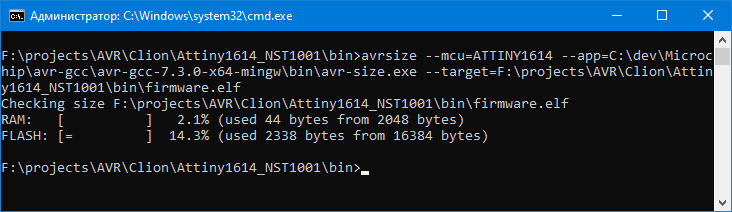
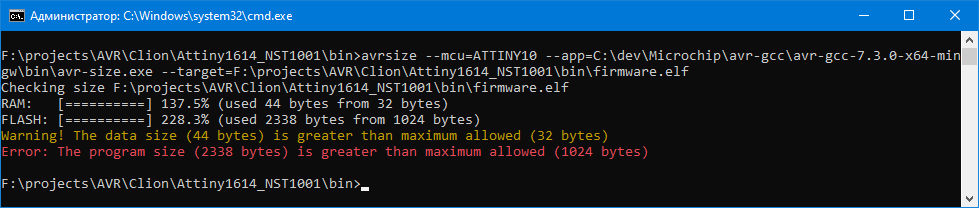
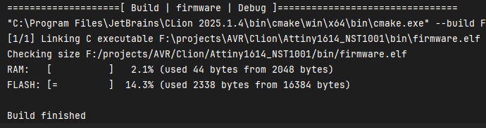

# avrsize

Простая программа для отображения объема использованной памяти микроконтроллеров AVR в консоли.  
Она работает аналогично выводу в Platformio. 

### Использование:
Нужно передать 3 параметра:  
<pre>
--mcu=      Название микроконтроллера. Например atmega16. Регистр не имеет значения.   
--app=      Полный путь до утилиты avr-size.exe(входит в комплект avr-gcc)    
--target=   Полный путь до файла *.elf 
</pre>

### Вызов из консоли:
<pre>
avrsize.exe --mcu=atmega16 --app=c:\dev\avr\bin\avr-size.exe --target=c:\projects\my_project\bin\firmware.elf
</pre>

  

### Вызов через CMakeLists.txt: 

<pre>
set(DEVICE attiny1614)
set(MY_AVRSIZE C:/dev/Microchip/my_avrsize/avrsize.exe)
set(TOOLS_PATH C:/dev/Microchip/avr-gcc/avr-gcc-7.3.0-x64-mingw)
set(AVRBIN ${TOOLS_PATH}/bin)
set(AVRSIZE avr-size.exe)
...........
add_custom_command(TARGET ${PROJECT_NAME} POST_BUILD
        COMMAND ${MY_AVRSIZE} --app=${AVRBIN}/${AVRSIZE} --target=${CMAKE_RUNTIME_OUTPUT_DIRECTORY}/${PROJECT_NAME}.elf --mcu=${DEVICE}
)
</pre>
 

При сборке проекта будет куча предупреждений.  
Для уменьшения размера и что бы удалить иконку я (в `avrsize.dpr`) подключил облегченный файл ресурсов.  
Так что не обращайте внимания. При желании верните обратно `{$R *.res}`

Для сборки проекта требуется библиотека [x-superobject](https://github.com/onryldz/x-superobject)  
Для работы программы необходима база данных `db.json`, которая находится в папке `db`  
Этот файл обязательно должен находится рядом с программой.

Вы так же можете добавить данные об отсутствующих контроллерах вручную или в каталоге  
`parser` лежит утилита которая извлекает нужные данные из пакетов DFP которые можно скачать с сайта [Microchip](https://packs.download.microchip.com/)  
В утилите нужно выбрать файл `*.pdsc`, например - `Microchip.ATmega_DFP.pdsc`
